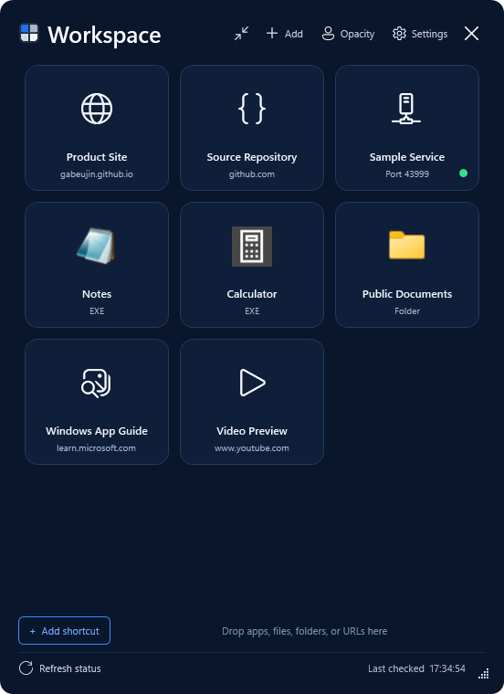

# Workspace Widget

[](https://github.com/Gabeujin/workspace-widget/actions/workflows/public-source.yml)

[Product site](https://gabeujin.github.io/workspace-widget/) ·
[Privacy](https://gabeujin.github.io/workspace-widget/privacy/) ·
[Support](https://gabeujin.github.io/workspace-widget/support/) ·
[Source-only RC](https://github.com/Gabeujin/workspace-widget/releases/tag/v0.1.0-rc.1)

Workspace Widget is a movable Windows 11 launcher for local web apps,
applications, files, folders, and URLs. It runs as the branded
`WorkspaceWidget.exe`; no console or `wscript.exe` window is used.

Version `0.1.0` is a Windows-only release candidate. Its supported public
distribution channel is a Microsoft Store MSIX package. Local development
packages are unsigned and must never be presented as public downloads.



## Highlights

- Drop or add `.lnk`, `.url`, EXE, file, folder, and HTTP/HTTPS targets.
- Resolve a `.lnk` to its real target and preserve its arguments, working
  directory, icon resource, and requested window style.
- Add, edit, reorder, hide, restore, and remove widget entries. Removing an
  entry never deletes the original app, file, folder, or shortcut.
- Show `Port ####` for URLs with an explicit port and poll an optional health
  endpoint every 30 seconds.
- Start a trusted offline Node project or JavaScript entry, wait for its health
  endpoint, and open it when ready.
- Use native Windows icons, smooth scrolling, free move/resize, opacity and
  hover brightness, **Always on top**, and a 96 px edge-snapped **MIN UI** mode.
- Choose Midnight, Neon, Sakura, Monochrome, or fully custom colors.
- Use a local image, animated GIF, video, bounded public HTTPS static image, or
  YouTube poster as a background. Each shortcut may have its own icon and hover
  media; YouTube hover playback uses the privacy-enhanced embed domain through
  WebView2. Direct remote video streams are rejected.
- Hide to the notification area, reopen from the tray or desktop shortcut, and
  exit from tray right-click → **Exit**.
- Optionally return behind ordinary apps when inactive with **Keep on desktop
  layer**. An explicit shortcut or tray open always presents the window.
- Control the package-declared Windows startup task from **Start with Windows**.

## Requirements

- 64-bit Windows 11, build 22000 or newer
- Microsoft Edge WebView2 Evergreen Runtime for YouTube hover playback
  (normally included with Windows 11)
- The package includes a pinned Node.js runtime and npm for configured
  offline-service startup

Other operating systems and 32-bit Windows are not supported.

## Install

The certified Microsoft Store listing is not available yet. No unsigned MSIX
or legacy installer is offered as a public download. Until certification,
review the public source and source-only release candidate instead.

After Microsoft Store certification, Windows will install the Store-signed
MSIX, create the app identity and Start entry, and service future updates. The
app asks Windows to enable its declared startup task only when the user turns
on **Start with Windows**.

The existing Inno Setup and unpackaged install scripts are retained only for
local development and migration testing; they are not supported public release
artifacts.

See [Installation](docs/INSTALLATION.md) and
[Microsoft Store release](docs/MICROSOFT-STORE-RELEASE.md).

## Add a local web app

Open **Add shortcut** and enter:

- **URL or local path**, for example `http://127.0.0.1:43100/`;
- optional **Health URL**, such as `http://127.0.0.1:43100/health`;
- optional **Node start target**, either `.js`, `.mjs`, `.cjs`, or a directory
  with `package.json`;
- optional package script or entry-file arguments.

If health is offline, clicking the card starts the configured target, waits up
to 30 seconds, and opens the URL after health succeeds. Only configure code and
endpoints you trust; they run or receive requests with the current user's
permissions.

Node discovery order is:

1. `WORKSPACE_WIDGET_NODE`, `WORKSPACE_WIDGET_PNPM`, and
   `WORKSPACE_WIDGET_NPM`;
2. package-local `runtime\node\node.exe` and `runtime\node\npm.cmd`, or
   package-local `runtime\pnpm\pnpm.cmd`;
3. `node.exe`, `pnpm.cmd`, or `npm.cmd` on `PATH`.

For a package directory, pnpm is preferred when available and npm is the
built-in fallback. Workspace Widget never installs project dependencies by
itself; the configured project must already be runnable.

## Appearance and media

Open Settings → **Appearance & media** to set a theme, custom ARGB colors,
background media, opacity, and video mute state. Edit a shortcut to set its
custom icon and hover media.

Remote media must resolve to a public HTTPS address. Remote raster images are
downloaded through a bounded, redirect-checked 10 MB cache before Windows
decodes them. Animated GIF backgrounds are local-only. YouTube links display a
validated poster as the widget background and play inside the shortcut hover
preview when WebView2 is available. Use only media you trust and have permission
to display. See [Media customization](docs/MEDIA-CUSTOMIZATION.md).

## Build from source

Use a normal, non-elevated Windows PowerShell 5.1 session:

```powershell
powershell.exe -NoProfile -ExecutionPolicy Bypass -File .\scripts\Build-WorkspaceWidget.ps1
```

The base build compiles the x64 native host, restores checksum-pinned
dependencies, and stages an allowlisted package. Store packaging is a separate
step that requires the exact Partner Center Product identity:

```powershell
powershell.exe -NoProfile -ExecutionPolicy Bypass `
  -File .\scripts\Build-WorkspaceWidgetMsix.ps1 `
  -Version 0.1.0 `
  -IdentityFile C:\secure-local-config\workspace-widget-store-identity.json `
  -CompilerPath C:\path\to\Roslyn\csc.exe `
  -OutputRoot C:\WorkspaceWidgetStoreBuild\0.1.0 `
  -StoreSubmission
```

The Store-targeted command produces an unsigned producer MSIX plus a
package-relative SHA-256 receipt. It accepts no external stage: it rebuilds
from a clean Git checkout, requires deterministic compilation, rechecks that
the checkout stayed clean, and invokes the Store-candidate verifier before
returning success. Microsoft validates and re-signs accepted MSIX submissions.
Do not sideload or distribute the unsigned producer file.

## Verify

`scripts\Test-WorkspaceWidget.ps1` is the unpackaged workstation integration
test. Store release validation additionally covers package identity,
`windows.startupTask`, install/update/uninstall, and Windows App Certification
Kit behavior against the exact MSIX candidate.

Release artifacts must pass the clean package, security, Store identity,
Windows App Certification Kit, and Partner Center certification gates in
[Public release review](PUBLIC-RELEASE-REVIEW.md).

## Development transparency

AI-assisted development tools were used during implementation and review.
Human maintainers selected the product behavior, reviewed and accepted the
source, and remain responsible for the release. Workspace Widget itself does
not include or call a generative-AI service and does not generate AI content.
See the voluntary
[AI-assisted development notice](docs/AI-ASSISTED-DEVELOPMENT.md).

## License and security

Workspace Widget is licensed under the [MIT License](LICENSE). Node.js,
WebView2, and legacy development-installer notices are listed in
[Third-party notices](THIRD-PARTY-NOTICES.md). Review
[Security policy](SECURITY.md) and [Privacy policy](PRIVACY.md) before
configuring executable targets or remote media.

For public help, use the [support page](https://gabeujin.github.io/workspace-widget/support/).
Report vulnerabilities through
[GitHub private security advisories](https://github.com/Gabeujin/workspace-widget/security/advisories/new),
not a public issue.
